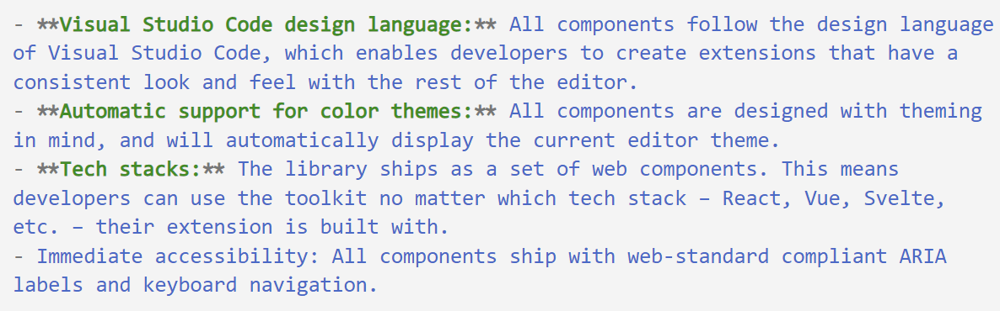
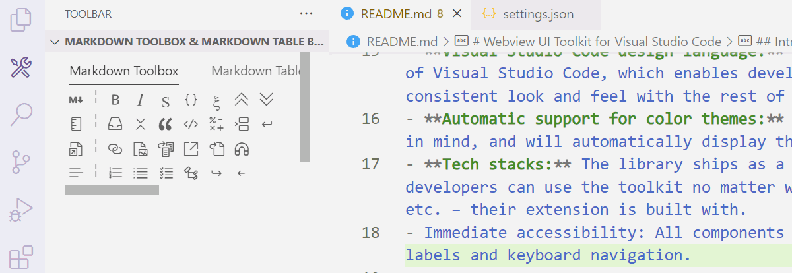
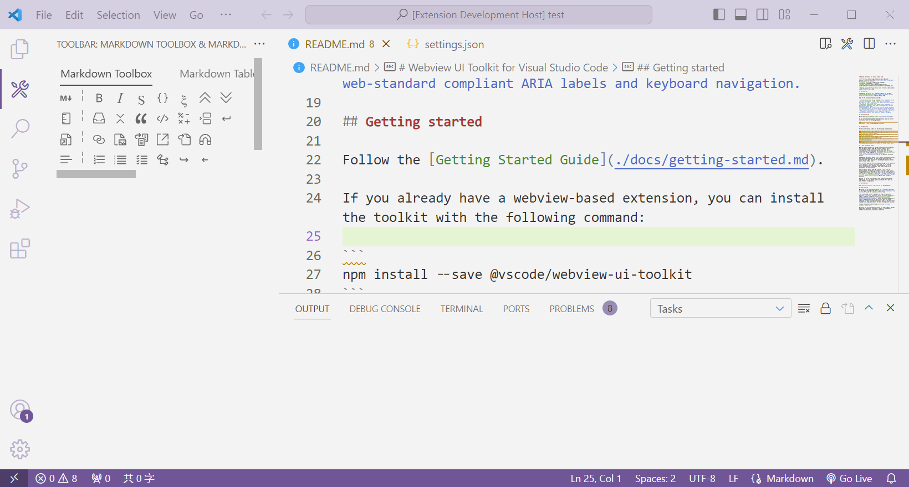
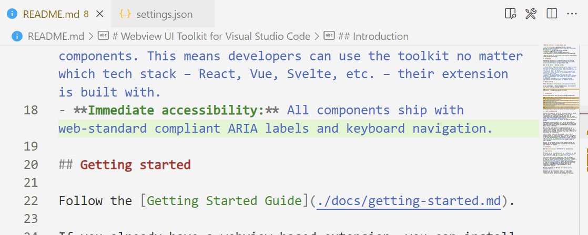
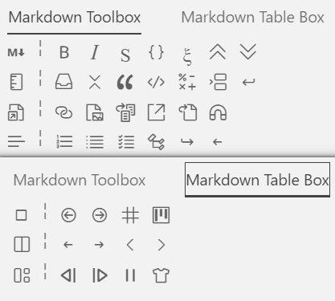

# toolbar README

>Until a day, I no longer wanted to remember those complicated keyboard shortcuts. With one hand on the mouse, the remaining hand on the keyboard was not enough for me to press <kbd>Ctrl</kbd>+<kbd>Shift</kbd>+<kbd>P</kbd>.

[☝️中文介绍](./docs/README.zh-cn.md)


<details> <summary> 目录 </summary>

- [toolbar README](#toolbar-readme)
  - [Features](#features)
    - [Provide Highly Customizable Toolboxes, Toolbars and Tools](#provide-highly-customizable-toolboxes-toolbars-and-tools)
    - [Built-in Markdown Toolbox](#built-in-markdown-toolbox)
      - [Markdown Toolbox](#markdown-toolbox)
      - [Markdown Table Toolbox (denpendent on other extensions)](#markdown-table-toolbox-denpendent-on-other-extensions)
  - [Requirements](#requirements)
  - [Extension Settings](#extension-settings)
  - [Known Issues](#known-issues)
  - [Custom Toolbox](#custom-toolbox)
    - [Basic Toolbox](#basic-toolbox)
    - [Toolbox](#toolbox)
    - [Activation Status](#activation-status)
    - [Toolbar](#toolbar)
    - [Tool](#tool)
    - [Action](#action)
    - [Multiple Tools Using the Same Action](#multiple-tools-using-the-same-action)
  - [Thanks](#thanks)

</details>

## Features

As the name suggests, it adds a toolbar to VSCode.

- **Floating Toolbar**: Adds a toolbar to the floating window for the specified language.
  
- **Toolbar Panel**: Exists as a View, which can be placed in the sidebar, panel, or any other location within the editor interface. It adds a button to the upper right corner of the editor for the specified language to open the toolbar interface.
  
  
  

### Provide Highly Customizable Toolboxes, Toolbars and Tools

You can customize toolboxes, toolbox layers, tools, and actions.

The extension provides 9 View positions for customization (Views are interfaces in VSCode that can be freely moved and rearranged). Each View can have multiple toolboxes, and each toolbox is composed of multiple toolbox layers (a toolbox layer is equivalent to a row of buttons). Each toolbox layer can have multiple tools (buttons), and when a tool is clicked, it can trigger a series of actions.

You can customize three types of actions: executing VSCode commands, finding and replacing selected text blocks, and executing a piece of code on the selected text block (TODO).

Tutorials and examples for customizing toolbars: [At the end of the article](#custom-toolbox)

### Built-in Markdown Toolbox

The extension provide the built-in toolboxes, containing 42 tools for dealing markdown text.



#### Markdown Toolbox

|Toolbox Layer||||||||
|--|--|--|--|--|--|--|--|
|Formatting|Toggle Bold|Toggle Italic|Toggle Strikethrough|Toggle Code Span|Toggle Math Span|Increase Header Level|Decrease Header Level|
|Blocks|Toggle Container Bloc|Toggle Detail Block|Toggle Quote Block|Toggle Code Block|Toggle Math Block|Insert Divider|Insert New Line|
|Links|Insert Link|Insert Image|Insert Link Reference|Insert Footnotes|Insert Path|Delete Link|
|Lists|Toggle Order List|Toggle Unorder List|Toggle Check List|*Create Content List*|*Indent*|*Outdent*|

(The actions of *Create Content List*, *Indent* and *Outdent* are denpendent on other extensions)

#### Markdown Table Toolbox (denpendent on other extensions)

|Toolbox Layer|||||
|--|--|--|--|--|
|Cell|Previous Cell|Next Cell|Create Table|CSV To Table|
|Column|Move Left|Move Right|Insert Left|Insert Right|
|Formatting|Align Left|Align Right|Align Center|Format|

## Requirements

You can *optionally* install the following plugins, as some features in the built-in toolbox rely on them:

- [Markdown All in One](vscode:extension/yzhang.markdown-all-in-one) : Provides list header indentation and table of contents creation features.
- [Markdown Table](vscode:extension/TakumiI.markdowntable) : Enables Markdown Table toolbox for table creation and formatting.
- [Markdown Table Maker](vscode:extension/hellorusk.markdown-table-maker) : Adds table creation functionality to the Markdown Table toolbox.

## Extension Settings

- `toolbar.hover.languages`: Languages support of the hover tooltip (when selecting text in the corresponding language editor, a tooltip will appear)
- `toolbar.panel.languages`: Languages support of the additional panel (will add a button to the right top of the corresponding language editor to open the additional panel)
- `toolbar.actions`: Actions of the tool
- `toolbar.toolboxs`: Toolboxes
- `toolbar.builtin.markdown.activate`: Whether to activate the built-in Markdown toolbox
- `toolbar.builtin.markdown.unorderListStyle`: Set the style of the built-in Markdown toolbox's unordered list, optional values are `-`, `+` and `*`; default value is `+`
- `toolbar.builtin.markdown.orderListStyle`: Set the style of the built-in Markdown toolbox's ordered list, optional values are `1)` and `1.` ; default value is `1.`

## Known Issues

haven't

## Custom Toolbox

This extension toolbox is designed with four levels:

1. **View**: A freely movable interface in VS Code, such as the Explorer in the sidebar. This extension comes with nine built-in Views for use in the toolbox, named after the names of the planets in our solar system:
   > "markdown", "mercury", "venus", "terra", "mars", "jupiter", "saturn", "uranus", "neptune"
2. **Toolbox**: The toolbox is composed of multiple Toolbox layers. The toolbox is the most basic part within a View, and a View can contain multiple toolboxes.
3. **Toolbox layer**: The toolbox is divided into multiple Toolbox layers by rows. Each Toolbox layer is composed of various tools.
4. **Tool**: Tools are displayed as buttons on the interface and are the most basic action combinations.

### Basic Toolbox

Copy the following content to the settings file:

```json
"toolbar.toolboxs": [
  {
    "name": "My Box",
    "activate": true,
    "view": "mars",
    "layers": [
      {
        "name": "My Layer",
        "icon": "person",
        "tools": [
          {
            "name": "Open Extensions Folder",
            "icon": "folder-library",
            "actions": ["workbench.extensions.action.openExtensionsFolder"]
          }
        ]
      }
    ]
  }
],
```

Then click on the "View -> Open View -> Mars Toolbar" button on the top of VSCode, and you will see a button appear on the side bar.  
  
The action defined for this tool is to execute the VSCode command: `workbench.extensions.action.openExtensionsFolder`, which means to open the extensions folder.  
  
### Toolbox  
  
In the settings file, the toolbox list is defined by `"toolbar.toolboxs"`.  

```jsonc
"toolbar.toolboxs": [ // This is the list of toolboxes, where each object in the list represents a toolbox.  
  {  
    // The name of the toolbox, which will be displayed as the title.  
    "name": "My Box",   
  
    // The view displayed by the toolbox, which can only be one of the following specific views. If there are multiple toolboxes on an view, they will share the same view.  
    // "markdown", "mercury", "venus", "terra", "mars", "jupiter", "saturn", "uranus", "neptune"  
    "view": "mars",   
  
    // The activation status, which can be a boolean value or an object with properties {"languages":[], "hover":false}.  
    "activate": true,   
  
    // The toolbar, displayed as a row within the toolbox.  
    "layers": [],   
  }  
]
```

### Activation Status

Activation status is used in toolboxes, toolbox layers, and tools. The value that can be entered is a boolean or an object.

```jsonc

// When set to true, activation is consistent with the activation status of the parent.  
"activate": true  
  
// When set to false, it is always inactive.  
"activate": false  
  
"activate":{  
  
  // When the opened text is in one of the specified languages, activate.  
  "languages":[  
    // Language ID, e.g., "markdown".  
    "markdown"  
  ],  
  
  // Optional, whether to display in the tooltip.  
  "hover":true  
}

```

### Toolbar

Defined in the `"layers"` list within a toolbox object.

Supported icon names can be found in the [Icon Reference](https://code.visualstudio.com/api/references/icons-in-labels).

```jsonc

"layers":[
  {
    // Toolbox layer name  
    "name": "",  
      
    // Optional, icon name. Enter a supported icon name from https://code.visualstudio.com/api/references/icons-in-labels.  
    // If no suitable icon is found, use a string starting with "$" as the name, e.g., "$∑". It is recommended not to exceed 3 characters.  
    "icon": "person",  
      
    // Optional, toolbox layer description. It will be displayed when the mouse hovers over the toolbox layer. If left blank, the toolbox layer's name will be displayed instead.  
    "description": "",  
      
    // Optional, activation status. It can be a boolean value or an object {"languages":[], "hover":false}.  
    "activate": true,  

    //Tools, appear as buttons in the toolbox layer  
    "tools":[],
  }
]


```

### Tool

Defined in the `"tools"` list within a toolbar object.

```jsonc

"tools": [
  {
    // Tool name  
    "name": "",  
      
    // Optional, icon name. Enter a supported icon name from https://code.visualstudio.com/api/references/icons-in-labels.  
    // If no suitable icon is found, use a string starting with "$" as the name, e.g., "$∑". It is recommended not to exceed 3 characters.  
    "icon": "person",  
      
    // Optional, tool description. It will be displayed when the mouse hovers over the tool. If left blank, the tool's name will be displayed instead.  
    "description": "",  
      
    // Optional, activation status. It can be a boolean value or an object {"languages":[], "hover":false}.  
    "activate": true,  
      
    // Actions of the tool. A tool can have multiple actions executed in sequence.  
    "actions": []
  }
]

```

### Action

Tool actions support three types: executing a VSCode command, performing a find and replace operation on selected text blocks, and executing a piece of code on selected text blocks (TODO).

Actions are defined in the `"actions"` list within a tool object.

Supports input of a string, or a "Command Action" object, or a "Replace Action" object.

```jsonc
"actions":[
  // String, you can type a VS Code command or a defined action name
  "workbench.extensions.action.openExtensionsFolder",

  // "Command Action" object
  {
    // Specify the action type as "Command Action"
    "mode": "command",

    // VS Code command specified by "Command Action"
    "command": "",

    // Optional, command arguments for "Command Action", which can be string, number, boolean, array, or object
    "argument": {}
  },

  // "Replace Action" object
  {
    // Specify the action type as "Replace Action"
    "mode": "replace",

    // Optional, argument for "Replace Action", which can be a string that replaces the selected text with this string
    "argument": "",

    // Optional, argument for "Replace Action", which can be an object with three properties: "start", "end", and "self": {"regex", "with"}
    "argument": {
      // Optional, add or delete this string to the front of the selected text
      "start": "`",
      // Optional, add or delete this string to the back of the selected text
      "end": "`",
      // Optional, processing of the selected text, which can be a string (direct replacement)
      "self": "replacement",
      // Optional, processing of the selected text, which can be an object with two properties: "regex" and "with" (regular expression matching)
      "self": {
        // Regular expression used to match the selected text, where parentheses () can be used to delimit the text to be retained
        "regex": "\"(.+)\"",

        // String used to replace the selected text, where $1~$9 are used to mark the position of the retained text
        "with": "$1"
      }
    }
  }
]
```

Predefined Action Names:

```text
Markdown: Toggle Bold
Markdown: Toggle Italic
Markdown: Toggle Strikethrough
Markdown: Toggle Math Span
Markdown: Toggle Math Block
Markdown: Toggle Code Span
Markdown: Toggle Code Block
Markdown: Toggle Container Block
Markdown: Toggle Detail Block
Markdown: Toggle Quote Block
Markdown: Insert Link
Markdown: Insert Image
Markdown: Insert Link Reference
Markdown: Insert Footnotes
Markdown: Insert Path
Markdown: Delete Link
Markdown: Increase Header Level
Markdown: Decrease Header Level
Markdown: Insert Divider
Markdown: Insert New Line
Markdown: Toggle Order List
Markdown: Toggle Unorder List
Markdown: Toggle Check List
```

### Multiple Tools Using the Same Action

In the settings file, actions can be defined under `"toolbar.actions"`, which are able to be referenced . The actions defined here need to include the `"name"` property. And then write the preset `"name"` value inside the list of a tool `"actions": []`.

Example: Here are both buttons referencing the `"toggle-bold"` action.

```jsonc
"toolbar.actions": [
  {
    //Name of the action to referenced in tool
    "name": "toggle-bold",
    "mode": "command",
    "argument": "Markdown: Toggle Bold",
    "command": "toolbar.toggle",
  }
],
"toolbar.toolboxs": [
  {
    "name": "My Box",
    "activate": true,
    "view": "mars",
    "layers": [
      {
        "name": "My Layer",
        "icon": "person",
        "tools": [
          {
            "name": "Toggle Bold",
            "icon": "bold",
            "actions": ["toggle-bold"]
          },
          {
            "name": "Toggle Bold After Open Extensions Folder",
            "icon": "folder-library",
            "actions": ["workbench.extensions.action.openExtensionsFolder","toggle-bold"]
          }
        ]
      },
    ]
  }
],

```

## Thanks

Spark:

- [vscode-comment-translate](https://github.com/intellism/vscode-comment-translate)
- [agda-mode-vscode](https://github.com/banacorn/agda-mode-vscode)
- [MarkdownToolbar](https://github.com/MarcusElg/MarkdownToolbar)

Tools:

- [Typescript to Json Schema](https://github.com/yunke-yunfly/fast-typescript-to-jsonschema)
- [Wenxinyiyan](https://yiyan.baidu.com/): translate from Chinese to English
