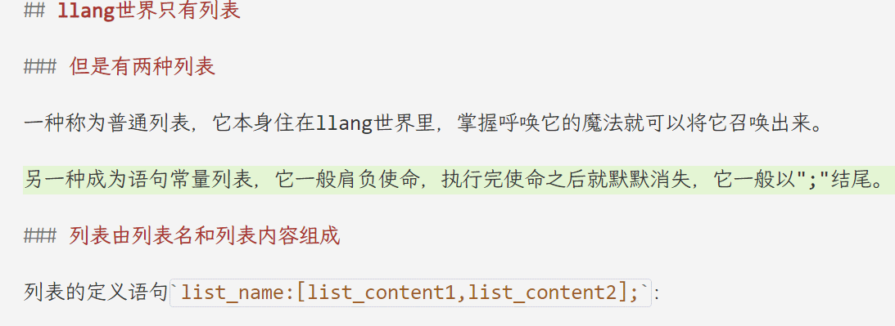
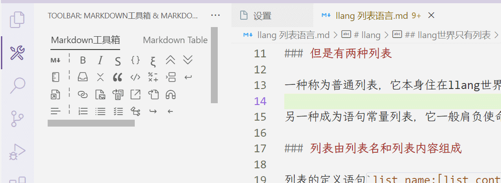
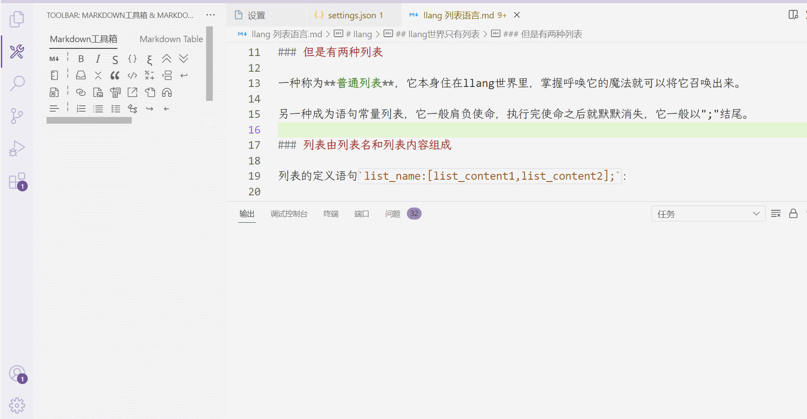
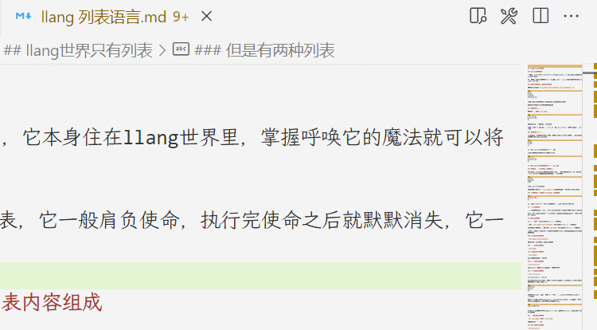
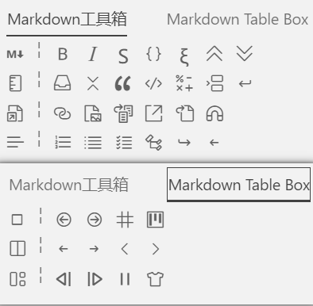

# toolbar README

>有一天，我再也不想记那些繁杂的快捷键.我的一只手在鼠标上，仅剩在键盘上的一只手不足以让我按下<kbd>Ctrl</kbd>+<kbd>Shift</kbd>+<kbd>P</kbd>

[☝️English](../README.md)


<details> <summary> 目录 </summary>

- [toolbar README](#toolbar-readme)
  - [功能](#功能)
    - [提供高度自定义的工具箱、工具栏、工具](#提供高度自定义的工具箱工具栏工具)
    - [内置Markdown工具箱](#内置markdown工具箱)
      - [Markdown工具箱](#markdown工具箱)
      - [Markdown Table工具箱（依赖其他插件）](#markdown-table工具箱依赖其他插件)
  - [依赖](#依赖)
  - [设置](#设置)
  - [已知问题](#已知问题)
  - [自定义工具箱](#自定义工具箱)
    - [最基础的工具箱](#最基础的工具箱)
    - [工具箱](#工具箱)
    - [激活情况](#激活情况)
    - [工具栏](#工具栏)
    - [工具](#工具)
    - [动作](#动作)
    - [多个工具使用同一个动作](#多个工具使用同一个动作)
  - [致谢](#致谢)

</details>

## 功能

顾名思义，为vscode添加了工具栏。

- **悬浮框工具栏**：为指定语言添加了在悬浮框内的工具栏。
  
- **工具栏界面**：作为View的形式存在，它可以放在侧边栏、放在面板、放在编辑器界面分割的位置等等。在指定语言的编辑器右上角添加了打开工具栏界面的按钮。
  
  
  

### 提供高度自定义的工具箱、工具栏、工具

可以自定义工具箱、工具栏、工具、动作。

扩展提供了9个View的位置可供自定义（View是在vscode中可以自由移动布局的界面）。一个View内可以自定义多个工具箱，一个工具箱又由多层工具栏组成（一个工具栏相当于一行按钮），一个工具栏可以自定义多个工具（按钮），一个工具点击时可以触发一连串动作。

可以自定义3种动作类型：执行vscode命令、对选中文本块进行查找替换、对选中文本块执行一段代码（TODO）。

自定义工具栏的教程和例子：[文章末尾](#自定义工具箱)

### 内置Markdown工具箱

内置了2个工具箱，42种Markdown处理工具。



#### Markdown工具箱

|工具栏名||||||||
|--|--|--|--|--|--|--|--|
|格式|加粗|斜体|删除线|代码段|公式段|标题提升|标题降级|
|文本块|容器|折叠|引用|代码块|公式块|分隔|新一行|
|链接|插入链接|插入图片|插入链接引用|插入脚注|插入文件路径|删除链接|
|列表|有序列表|无序列表|任务列表|*目录列表*|*缩进*|*删除缩进*|

（*目录列表* *缩进* *删除缩进* 依赖于其他扩展）

#### Markdown Table工具箱（依赖其他插件）

|工具栏名|||||
|--|--|--|--|--|
|Cell|Previous Cell|Next Cell|Create Table|CSV To Table|
|Column|Move Left|Move Right|Insert Left|Insert Right|
|Formatting|Align Left|Align Right|Align Center|Format|

## 依赖

你可以*选择性*安装以下插件，内置工具箱中的一些功能依赖于以下插件：

- [Markdown All in One](vscode:extension/yzhang.markdown-all-in-one) : 用于提供列表的表头缩进功能以及创建目录功能
- [Markdown Table](vscode:extension/TakumiI.markdowntable) : 用于提供Markdown Table工具箱的表格功能
- [Markdown Table Maker](vscode:extension/hellorusk.markdown-table-maker) : 用于提供Markdown Table工具箱的创建表格的功能

## 设置

- `toolbar.hover.languages`: 悬浮框支持的语言，（在对应语言的编辑器内选中文本时，出现工具箱悬浮框）
- `toolbar.panel.languages`: 额外面板支持的语言（会在对应语言的编辑器右上方添加一个打开额外面板的按钮）
- `toolbar.actions`: 工具箱动作的自定义
- `toolbar.toolboxs`: 工具箱的自定义
- `toolbar.builtin.markdown.activate`: 是否激活内置的Markdown工具箱
- `toolbar.builtin.markdown.unorderListStyle`: 设置内置Markdown工具箱无序列表的样式，可选值是`-`,`+`,`*`，默认值是`+`
- `toolbar.builtin.markdown.orderListStyle`: 设置内置Markdown工具箱有序列表的样式，可选值是`1)`和`1.`，默认值是`1.`

## 已知问题

暂无

## 自定义工具箱

本扩展工具箱设计分为4个层级：

1. **View**：在vscode中可以自由移动布局的界面，例如侧边栏的Explorer就是一个View。本扩展内置了9个View可供工具箱使用，按照太阳系行星名称命名：
   > "markdown","mercury","venus","terra","mars","jupiter","saturn","uranus","neptune"
2. **工具箱**：工具箱由多个工具栏组成。工具箱是View内最基础的部分，一个View可以放置多个工具箱。
3. **工具栏**：工具箱按照行分为多个工具栏，工具栏由多种工具组成。
4. **工具**：工具在界面上显示为按钮，也是最基础的动作组合。

### 最基础的工具箱

复制以下内容到设置文件中

```json
"toolbar.toolboxs": [
  {
    "name": "My Box",
    "activate": true,
    "view": "mars",
    "layers": [
      {
        "name": "My Layer",
        "icon": "person",
        "tools": [
          {
            "name": "Open Extensions Folder",
            "icon": "folder-library",
            "actions": ["workbench.extensions.action.openExtensionsFolder"]
          }
        ]
      }
    ]
  }
],
```

然后点击vscode上方的“查看->打开视图->Mars Toolbar”，就可以看到一个按钮出现在了侧边栏上。

这里工具定义的动作是执行vscode命令：`workbench.extensions.action.openExtensionsFolder`，即打开扩展文件夹。

### 工具箱

在设置文件中，由`"toolbar.toolboxs"`引出定义工具箱列表。

```jsonc
"toolbar.toolboxs": [ //这是工具箱列表，列表中的一个对象就是一个工具箱
  {
    //工具箱的名称，将会作为标题显示
    "name": "My Box", 

    //工具箱显示的界面，只能为以下特定界面。如果一个界面有多个工具箱，则多个工具箱会共用一个界面。
    //"markdown","mercury","venus","terra","mars","jupiter","saturn","uranus","neptune"
    "view": "mars", 
    
    //激活情况，可以为一个boolean值，或者一个{"languages":[],"hover":false}对象；
    "activate": true, 
    
    //工具栏，作为一个行显示在工具箱里
    "layers": [], 
  }
]
```

### 激活情况

激活情况在工具箱、工具栏、工具中都会用到，可填写的值为boolean或者一个对象。

```jsonc

//当为true时，和上级激活情况一致；
"activate": true

//当为false时，总是不激活
"activate": false

"activate":{

  //当打开的文本是其中的语言时，激活
  "languages":[
    //语言ID，例如“markdown”
    "markdown"
  ],

  //可选，是否显示在悬浮框中
  "hover":true
}

```

### 工具栏

在工具箱的对象中，定义在`"layers"`列表内。

支持的图标名称，可以在[Icon Ref](https://code.visualstudio.com/api/references/icons-in-labels)中找到。

```jsonc

"layers":[
  {
    //工具栏的名称
    "name": "",

    //可选，图标名称，输入https://code.visualstudio.com/api/references/icons-in-labels 支持的图标名称；
    //如果没有合适的图标，输入$开头的字符串作为名称，例如"$∑"，最好不要超过3个字母
    "icon": "person",

    //可选，介绍，当鼠标悬浮在工具栏上面时，出现工具栏的介绍；不填写则悬浮出现工具栏的名称
    "description": "",

    //可选，激活情况，可以为一个boolean值，或者一个{"languages":[],"hover":false}对象；
    "activate": true,

    //工具，作为一个按钮出现在工具栏中
    "tools":[],
  }
]


```

### 工具

在工具栏的对象中，定义在`"tools"`列表内。

```jsonc

"tools": [
  {
    //工具的名称
    "name": "",

    //可选，图标名称，输入https://code.visualstudio.com/api/references/icons-in-labels 支持的图标名称；
    //如果没有合适的图标，输入$开头的字符串作为名称，例如"$∑"，最好不要超过3个字母
    "icon": "person",

    //可选，介绍，当鼠标悬浮在工具上面时，出现工具的介绍；不填写则悬浮出现工具的名称
    "description": "",

    //可选，激活情况，可以为一个boolean值，或者一个{"languages":[],"hover":false}对象；
    "activate": true,

    //工具的动作，一个工具可以有多个动作，按顺序执行
    "actions":[]
  }
]

```

### 动作

工具的动作支持3种类型：执行vscode命令、对选中文本块进行查找替换、对选中文本块执行一段代码（TODO）。

在工具的对象中，动作定义在`"actions"`列表内。

支持输入一个字符串，或者一个“命令动作”对象或者“替换动作”对象。

```jsonc
"actions":[
  //字符串，可以键入一个vscode命令或者已定义的动作名称
  "workbench.extensions.action.openExtensionsFolder",

  //“命令动作”对象
  {
    //指定动作类型，是“命令动作”
    "mode": "command",

    //“命令动作”指定的vscode命令
    "command":"",

    //可选，“命令动作”的命令参数，可以是string number boolean array object
    "argument":{}
  },

  //“替换动作”对象
  {
    //指定动作类型，是“替换动作”
    "mode": "replace",

    //可选，“替换动作”的参数，可以为一个字符串，将选中文本替换为该字符串
    "argument":"",

    //可选，“替换动作”的参数，可以为一个有"start"、"end"、”self“:{"regex","with"}三个属性的对象
    "argument":{
        //可选，增加或者删除字符串到选中文本前部
        "start": "`",
        //可选，增加或者删除字符串到选中文本后部
        "end": "`",
        //可选，对选中文本的处理，可以为一个字符串（直接替换）
        "self": "replacement",
        //可选，对选中文本的处理，可以为一个有"regex"和"with"两个属性的对象（正则匹配）
        "self": {
          //用于匹配选中文本的正则表达式，在表达式中括号()可以用于划定留下来的文本
          "regex":"\"(.+)\"",

          //用于替换选中文本的字符串，在字符串中，用$1~$9来标记留下来的文本的位置
          "with":"$1"
        }
    }
  }
]
```

内置的已定义的动作名称如下：

```text
Markdown: Toggle Bold
Markdown: Toggle Italic
Markdown: Toggle Strikethrough
Markdown: Toggle Math Span
Markdown: Toggle Math Block
Markdown: Toggle Code Span
Markdown: Toggle Code Block
Markdown: Toggle Container Block
Markdown: Toggle Detail Block
Markdown: Toggle Quote Block
Markdown: Insert Link
Markdown: Insert Image
Markdown: Insert Link Reference
Markdown: Insert Footnotes
Markdown: Insert Path
Markdown: Delete Link
Markdown: Increase Header Level
Markdown: Decrease Header Level
Markdown: Insert Divider
Markdown: Insert New Line
Markdown: Toggle Order List
Markdown: Toggle Unorder List
Markdown: Toggle Check List
```

### 多个工具使用同一个动作

在设置文件中，在`"toolbar.actions"`下可以定义可被引用的动作。在这里定义的动作需要加入`"name"`属性。在工具的`"actions":[]`列表内，写入预设的`"name"`的值。

例如：这里两个按钮都引用了`"toggle-bold"`这个动作。

```jsonc
"toolbar.actions": [
  {
    //动作的名称，用于引用该动作
    "name": "toggle-bold",
    "mode": "command",
    "argument": "Markdown: Toggle Bold",
    "command": "toolbar.toggle",
  }
],
"toolbar.toolboxs": [
  {
    "name": "My Box",
    "activate": true,
    "view": "mars",
    "layers": [
      {
        "name": "My Layer",
        "icon": "person",
        "tools": [
          {
            "name": "Toggle Bold",
            "icon": "bold",
            "actions": ["toggle-bold"]
          },
          {
            "name": "Toggle Bold After Open Extensions Folder",
            "icon": "folder-library",
            "actions": ["workbench.extensions.action.openExtensionsFolder","toggle-bold"]
          }
        ]
      },
    ]
  }
],

```

## 致谢

灵感：

- [vscode-comment-translate](https://github.com/intellism/vscode-comment-translate)
- [agda-mode-vscode](https://github.com/banacorn/agda-mode-vscode)
- [MarkdownToolbar](https://github.com/MarcusElg/MarkdownToolbar)

使用的工具：

- [Typescript to Json Schema](https://github.com/yunke-yunfly/fast-typescript-to-jsonschema)
- [Wenxinyiyan](https://yiyan.baidu.com/): translate from Chinese to English
